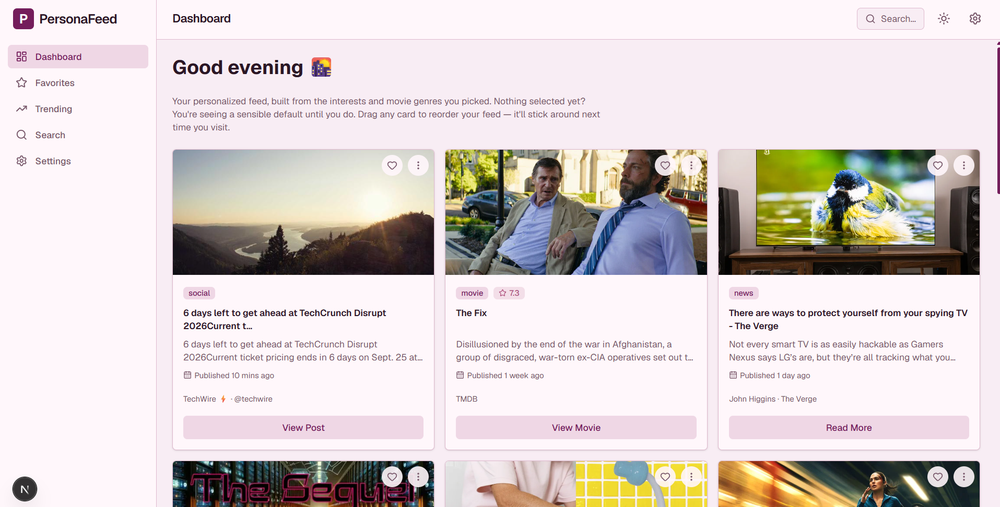
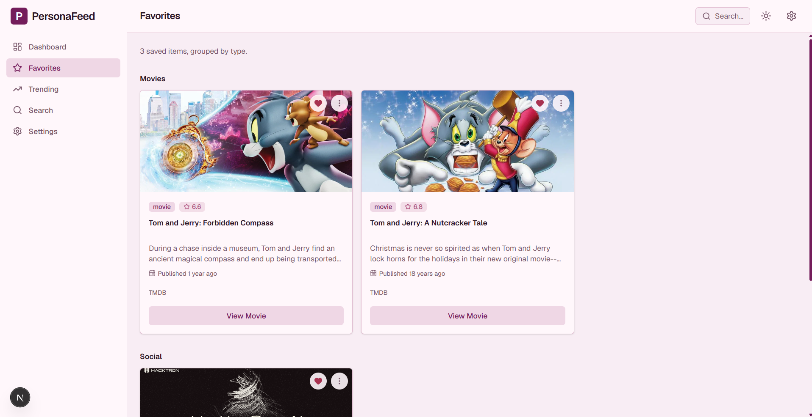
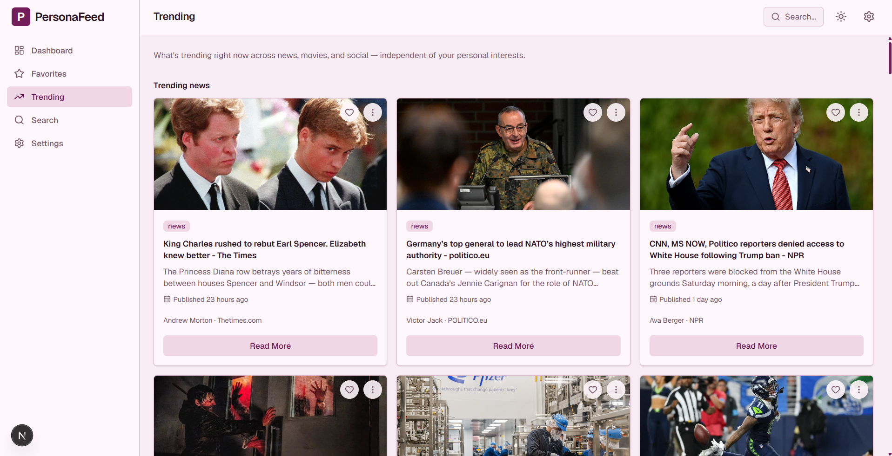
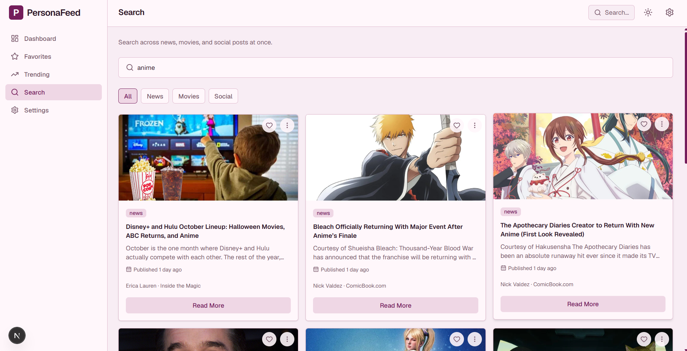

# ✨ Personalized Content Dashboard 

A unified, personalized content feed that blends **news, movie recommendations, and social posts** into a single dashboard — built with Next.js, TypeScript, and Redux Toolkit. Pick your interests once, and the feed does the rest: fetching, normalizing, deduplicating, and ranking content from three unrelated APIs into one coherent stream.

## 🎯 Overview

Most content lives in silos — a news app, a movie app, a social app. This project explores what a single, personalized surface for all three could look like: one feed, one set of preferences, one favorites list, built on a shared content model so a news article, a movie, and a social post can all render through the same card component and the same interaction patterns .
The project was built incrementally end-to-end — application shell, design system, state management, API integration, personalization logic, interactivity, accessibility, performance, and testing — each added as its own phase, with the reasoning behind key decisions documented in `docs/PHASES.md`.

## 📌 Features

- **Personalized feed** — select interests and movie genres in Settings; the Dashboard fetches, merges, deduplicates, and sorts matching content chronologically across all three sources
- **Favorites** — save any card from anywhere in the app; a dedicated page groups saved items by type
- **Trending** — a preference-independent view of what's currently popular across news, movies, and social
- **Global search** — debounced, filterable by content type, searching all three sources in parallel
- **Drag-and-drop reordering** — rearrange your Dashboard feed by hand; the order persists across sessions
- **Infinite scroll & pagination** — content loads in batches, with real next-page fetches once the local buffer runs out
- **Dark mode** — Light / Dark / System, with an explicit toggle and persistence
- **Resilient loading states** — loading, partial-failure, full-error (with retry), and empty states for every data view, plus an offline banner that distinguishes "no network" from "an API is down"
- **Accessible by default** — audited contrast ratios, keyboard navigation, focus management, skip links, and semantic landmarks

## 📸 Screenshots

<table>
  <tr>
    <td align="center">
      <strong>▦ Dashboard</strong>
    </td>
    <td align="center">
      <strong> ☆ Favorites</strong>
    </td>
  </tr>
  <tr>
    <td>
      
    </td>
    <td>
      
    </td>
  </tr>
  <tr>
    <td align="center">
      <strong>↗ Trending</strong>
    </td>
    <td align="center">
      <strong> ⌕ Search</strong>
    </td>
  </tr>
  <tr>
    <td>
      
    </td>
    <td>
      
    </td>
  </tr>
</table>

## 🛠️ Tech Stack

| Layer | Choice |
|---|---|
| Framework | Next.js (App Router) + React + TypeScript |
| Styling | Tailwind CSS |
| State management | Redux Toolkit + RTK Query |
| Animation | Framer Motion |
| Drag-and-drop | dnd-kit |
| Icons | lucide-react |
| Data sources | News API, TMDB API, Mastodon public timeline API |
| Testing | Vitest + React Testing Library |

## ⬇️ Architecture

The app follows a straightforward data pipeline, repeated for every content source:

```
User preferences → API request (server route) → raw response
  → normalize() → ContentItem → merge/dedupe/sort → Redux store → UI
```

Key architectural decisions:

- **Server-side API proxying.** News API and TMDB requests go through Next.js Route Handlers (`app/api/*`) rather than being called directly from the browser. This keeps API keys server-side and avoids News API's client-side CORS restriction.
- **A single unified content model.** Every card — regardless of source — is rendered from the same `ContentItem` shape (`types/content.ts`), so the UI layer never needs to know whether it's looking at a news article, a movie, or a social post.
- **Adapters, not ad-hoc parsing.** Each source has its own normalization function (`normalizeNews`, `normalizeMovie`, `normalizeSocial`) that converts its raw API shape into `ContentItem[]`, isolating the API-specific quirks (e.g. filtering News API's `[Removed]` takedown articles, TMDB's poster/backdrop fallback, stripping HTML from Mastodon content) in one place.
- **Resilience over completeness.** Parallel requests use `Promise.allSettled` rather than `Promise.all`, so one failing source degrades the feed gracefully instead of blanking results the other sources already returned successfully.

## 📂 Project Structure

```
app/
  api/            Server-side Route Handlers (news, tmdb, social)
  (dashboard)/    Dashboard, Favorites, Trending, Search, Settings routes
components/
  layout/         Sidebar, Header, MobileNav, DashboardShell
  ui/             Reusable design-system primitives (Button, Card, Modal, ...)
  content/        ContentCard and its type-specific variants (News/Movie/Social)
  providers/      Redux StoreProvider
store/
  slices/         preferences, favorites, feed, ui
services/         RTK Query API adapters (news, tmdb, social)
lib/              normalize.ts, feed.ts, storage.ts, preferences-options.ts
types/            Shared ContentItem model
tests/
  unit/           Reducers, normalization, feed logic, persistence, hooks
  integration/    Components rendered together against a real Redux store
docs/             PHASES.md — a running log of implementation decisions
```

## ⚙️ Installation and Setup

```bash
npm install
cp .env.local.example .env.local   # then fill in your API keys — see below
npm run dev
```

Open [http://localhost:3000](http://localhost:3000).

## Environment Variables

See `.env.local.example` for the full list.

**News API** — sign up free at [newsapi.org](https://newsapi.org/), and copy your API key into `NEWS_API_KEY`.

**TMDB API** — sign up free at [themoviedb.org](https://www.themoviedb.org/), go to **Settings → API**, and copy your v3 auth key into `TMDB_API_KEY`.

**Mastodon** — social content uses Mastodon's public timeline API (`mastodon.social`). No account and no API key required — it's a fully public, unauthenticated endpoint.

## API Setup

| Source | Endpoint used | Auth |
|---|---|---|
| News API | `top-headlines` (personalized by category, unfiltered for Trending) | Server-side API key |
| TMDB | `discover/movie` (by genre) and `trending/movie/week` (Trending) | Server-side API key |
| Mastodon | `timelines/tag/<hashtag>` (personalized) and `trends/statuses` (Trending) | None — public endpoint |

All three are called through their own Route Handler under `app/api/`, so credentials never reach the client.

## 🔗 State Management

Redux Toolkit organizes app state into four slices, combined with RTK Query for data fetching and caching:

- **`preferencesSlice`** — selected interests and movie genres, persisted to `localStorage`
- **`favoritesSlice`** — saved content items, persisted to `localStorage`
- **`feedSlice`** — the merged/deduped feed, loading and error status, and the saved drag-and-drop order
- **`uiSlice`** — theme (Light/Dark/System) and mobile navigation state

`newsApi`, `tmdbApi`, and `socialApi` (RTK Query) handle requests, caching, and loading/error states for each data source, and are wired into the store alongside the four slices. On mount, `StoreProvider` rehydrates preferences, favorites, theme, and feed order from `localStorage`, and re-persists each one whenever it changes.

## 🧩 Personalization Logic

The feed engine (`hooks/useFeed.ts`, `lib/feed.ts`) turns saved preferences into a ranked, deduplicated stream:

1. **Resolve preferences** — `getFeedCategories()` / `getFeedGenres()` fall back to a sensible default (Technology / Action) before a user has picked anything, so the app never shows an empty cold-start feed.
2. **Fetch in parallel** — one News API call and one Mastodon call per selected interest, one TMDB call per selected movie genre (genre names are mapped to TMDB's numeric IDs), all fired concurrently via RTK Query's `initiate()`/`unwrap()`.
3. **Normalize** — each response is converted into `ContentItem[]` by its adapter.
4. **Merge, dedupe, sort** — `mergeFeedItems()` combines every source's items, removes duplicates (by id, and by a normalized `type:title` key to catch the same story reposted with a different id), and sorts the result chronologically, newest first.
5. **Reapply saved order** — if the user has manually reordered their feed via drag-and-drop, `applySavedOrder()` re-applies that sequence over the freshly fetched items; anything new gets appended after.
6. **Paginate for real** — once the fetched buffer is exhausted, `loadMoreFeed()` fetches the next page from News API and TMDB (both support server-side pagination). Mastodon's public API has no page-number pagination for hashtag timelines, so social content is pulled once per load with a larger initial batch to compensate.

## 🚀 Testing

```bash
npm test          # run once
npm run test:watch # re-run on file changes
```

- **`tests/unit/`** — reducers for all four slices, all three normalization adapters, feed merge/dedupe/sort logic, the debounce hook, and `localStorage` persistence (including corrupted-data handling)
- **`tests/integration/`** — components rendered together against a real Redux store: the loading → error → empty → success state machine, Settings and Favorites pages wired to real reducers rather than mocks, and pagination control states

## 🔑 User Flow

1. **First visit** — land on the Dashboard, which shows a personalized feed built from sensible defaults
2. **Settings** — choose interests and movie genres; the Dashboard feed updates to match
3. **Browse** — scroll the feed (loads more automatically, or via a manual "Load more" button), favorite items of interest, or drag cards to reorder them
4. **Trending** — check what's currently popular, independent of personal preferences
5. **Search** — look up anything specific across news, movies, and social content, with type filters
6. **Favorites** — revisit everything saved, grouped by content type
7. Preferences, favorites, feed order, and theme all persist across sessions via `localStorage`

## 💡 Challenges & Solutions

- **Reconciling three unrelated API shapes.** News API, TMDB, and social content share almost no fields. Solved with a single `ContentItem` model and one normalization adapter per source, so every downstream component only ever deals with one shape.
- **Mastodon as a moving target.** Social data went through three iterations — mock data, then Reddit's public JSON endpoint (blocked by bot detection), then Reddit's OAuth flow (blocked by a CAPTCHA that wouldn't render) — before settling on Mastodon's public timeline API, which needs no account, key, or CAPTCHA at all.
- **A silent re-render bug.** Dashboard, Trending, and Search each built a `Set` of favorite ids inline inside `useAppSelector`, creating a new object reference on every call — which meant all three pages re-rendered on *every* Redux update, not just favorite changes. Fixed with a shared `useFavoriteIds()` hook that memoizes the `Set` and only rebuilds when the underlying favorites array actually changes.
- **One failing API source blanking the whole feed.** Parallel fetches originally used `Promise.all`, so a single TMDB hiccup discarded News API results that had already succeeded. Switched to `Promise.allSettled` so the feed degrades gracefully instead of failing completely.
- **Accessibility gaps that eyeballing missed.** A contrast-ratio audit (computed, not estimated) caught two real WCAG failures — a rating badge and a selected chip — both below the 4.5:1 threshold for normal text, since fixed and re-verified.

## 🔮 Future Improvements

- End-to-end testing (Playwright)
- Deployment
- Real pagination for Mastodon content, if/when the API supports it
- Additional content sources (e.g. podcasts, GitHub trending)
- User accounts, so preferences and favorites persist beyond a single browser
- A security audit pass over the API routes and environment handling

## 👧🏻 Author

### Anshika Agrawal
